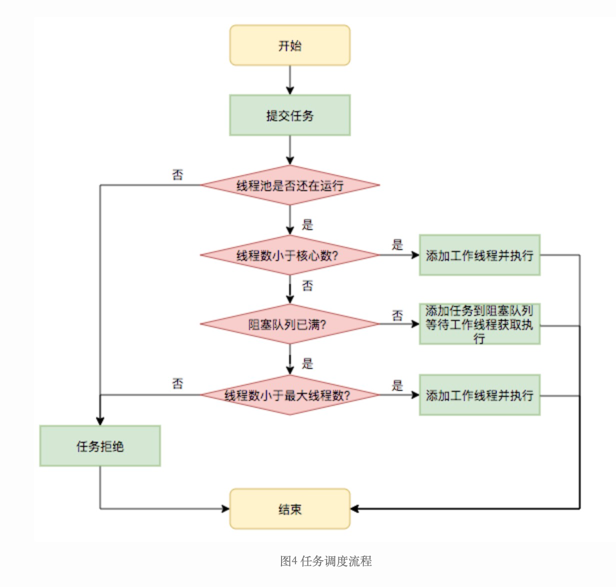
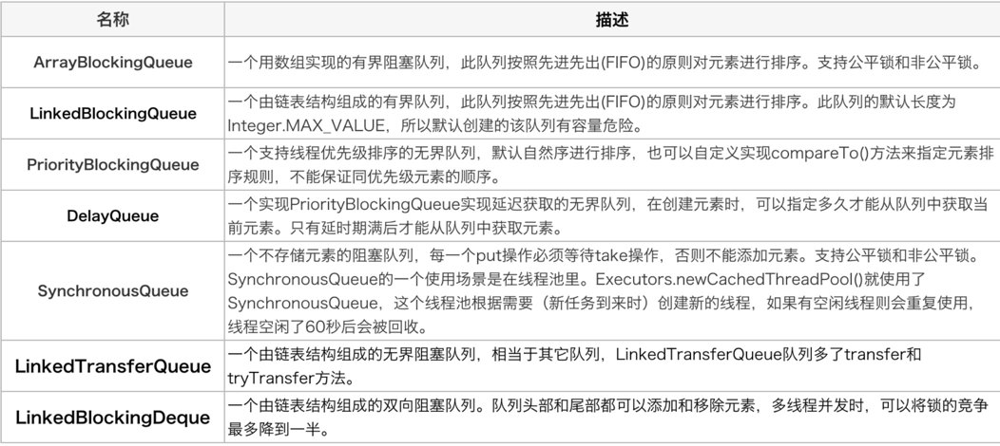
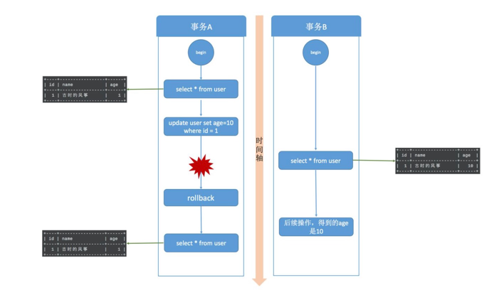
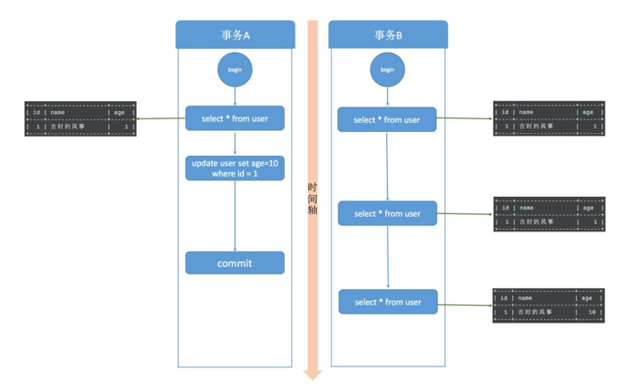
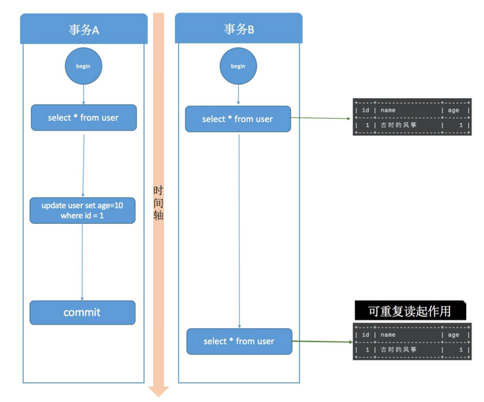
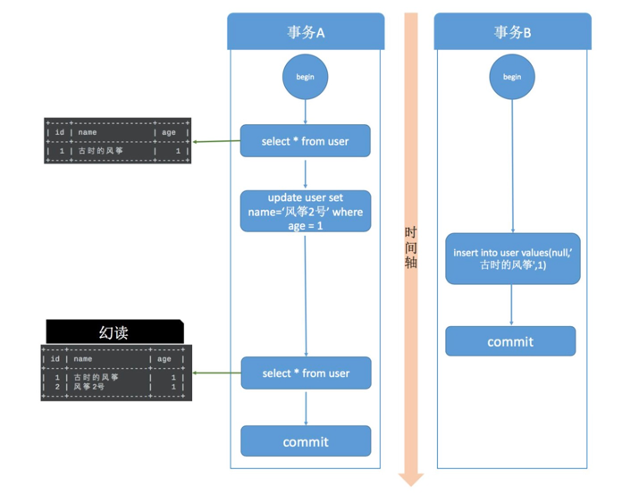

复习网址:
1. concurrenthashmap
   https://segmentfault.com/a/1190000024432650
   https://segmentfault.com/a/1190000024439085?utm_source=sf-similar-article
2. juc里的cas乐观锁
   https://segmentfault.com/a/1190000023839912
3. 可重入锁之-synchronized和ReentrantLock
   https://juejin.cn/post/6894798770685509639
4. synchronized原理+锁升级
   https://blog.csdn.net/Kurry4ever_/article/details/109557532
5. jvm调优
   https://zhuanlan.zhihu.com/p/363961261
6. canal解决mq消息顺序问题
   https://www.cxyzjd.com/article/m0_48043632/111642237
7. apollo原理
   http://c.biancheng.net/view/5482.html


# java基础
1. 对list<String>去重
    1. 用set;
    2. java8里的stream.distinct()方法;
       重写equals()方法和hashCode()方法, 再用list.contains方法比较
    3. 利用Iterator遍历，new list contains(string), remove方法移除去重
    4. hashmap的key不可重复

2. 为什么重写equals方法必须重写hashcode?  
   因为java约定, 两个相等的对象必须具有相等的散列码;如果不重写, 会导致对象相等, 但是有可能两个的散列码不相等;


# hashmap
- 数据结构  
  数据+链表,1.8之后新增红黑树,查询性能从o(n)提升到o(lgn)
- 允许key和value为null
- hashmap初始容量默认为16, 负载因子是0.75, 通过位运算每次扩容是2的n次方
- 1.8中优化点:新增了红黑树,从头插法改为尾插法,1.7先扩容再插入, 1.8先插入再扩容
  头插法和尾插发优缺点:因为1.7的头插法在并发情况下会产生环形链(a线程插入1->2, b线程扩容2>1);
- 扩容的时候为什么 1.8 不用重新 hash 就可以直接定位原节点在新数据的位置呢?
  因为扩容是扩为原来的两倍, 就是掩码最高位多了一个1, &运算, 两种情况:a.原数据hashcode最高位为0, 位置不变;b.为1,则位置=原来位置+原数组容量;
- hash函数计算过程: hash 函数是先拿到通过key的hashcode，是 32 位的 int 值，然后让 hashcode 的高 16 位和低 16 位进行异或操作。
- 为什么这样设计hash函数: 1.通过扰乱函数尽可能降低hash碰撞，使其分散越好；2.算法一定要尽可能高效，因为这是高频操作, 因此采用位运算；

hashmap的put过程:
1. 判断数组是否为空，为空进行初始化;
2. 不为空，计算 k 的 hash 值，通过(n - 1) & hash计算应当存放在数组中的下标 index;
3. 查看 table[index] 是否存在数据，没有数据就构造一个 Node 节点存放在 table[index] 中；
4. 存在数据，说明发生了 hash 冲突(存在二个节点 key 的 hash 值一样), 继续判断 key 是否相等，相等，用新的 value 替换原数据(onlyIfAbsent 为 false)；
5. 如果不相等，判断当前节点类型是不是树型节点，如果是树型节点，创造树型节点插入红黑树中；
6. 如果不是树型节点，创建普通 Node 加入链表中；判断链表长度是否大于 8， 大于的话链表转换为红黑树；
7. 插入完成之后判断当前节点数是否大于阈值，如果大于开始扩容为原数组的二倍
- 线程安全:  
  1.7会造成环形链,数据丢失,数据覆盖的问题;  
  1.8会有数据覆盖的问题, 也有死循环的问题(1.是在链表转换为树的时候for循环一直无法跳出 2.balanceInsertion平衡树的时候);  
  put的时候可能会造成数据不一致(eg:a线程判断数组为空,线程被挂起,b线程也判断为空,并往里设置值1,a线程恢复,将值覆盖为2;)  
  resize而引起死循环
- 为什么hashmap1.8使用红黑树不用二叉平衡树
    - CurrentHashMap中是加锁了的，实际上是读写锁，如果写冲突就会等待，如果插入时间过长必然等待时间更长，而红黑树相对AVL树他的插入更快
    - avl树更加平衡, 适合使用查询多的;
    - 插入数据, avl的旋转次数比红黑树更多;
- 为什么redis的zset使用跳表不用红黑树
    1. 跳表实现更简单
    2. zset有区间查询, 跳表的效率更高
- 说说你对红黑树的见解？
    - 每个节点非红即黑
        - 根节点总是黑色的
    - 如果节点是红色的，则它的子节点必须是黑色的（反之不一定）
        - 每个叶子节点都是黑色的空节点（NIL节点）
        - 从根节点到叶节点或空子节点的每条路径，必须包含相同数目的黑色节点（即相同的黑色高度）
- 怎么解决hashmap不安全?
    1. hashtable, 通过synchronized 关键字锁住整个数组,锁粒度大;
    2. Collections.synchronizedMap, 通过传入 Map 封装出一个 SynchronizedMap 对象, 内部是通过对象锁实现;
    3. ConcurrentHashMap分段锁;


# concurrenthashmap
1. currentHashMap的key和value都不允许为null(因为不知道是key为null还是value是null)
1. 大量的利用了volatile(禁止指令重排序,保证内存可见性),CAS等乐观锁技术来减少锁竞争对于性能的影响
2. ConcurrentHashMap保证线程安全的方案是：  
   JDK1.8：synchronized+CAS+HashEntry+红黑树  
   JDK1.7：ReentrantLock+Segment+HashEntry
3. Segment继承ReentrantLock, 是一种可重入锁，是一种数组和链表的结构，一个Segment中包含一个HashEntry数组(用volatile修饰, 保证了多线程下的可见性), 每个HashEntry又是一个链表结构，因此在ConcurrentHashMap查询一个元素的过程需要进行两次Hash操作，如下所示：
    - 第一次Hash定位到Segment
    - 第二次Hash定位到元素所在的链表的头部
4. 但在JDK1.8中摒弃了Segment分段锁的数据结构，基于CAS(乐观锁)操作保证数据的获取以及使用synchronized关键字对Node（首结点）（实现 Map.Entry) 加锁来实现线程安全，这进一步提高了并发性
5. 为什么使用synchronized替换可重入锁ReentrantLock?
    - jdk1.6中, 对 synchronized 锁的实现引入了大量的优化，并且 synchronized 有多种锁状态，会从无锁 -> 偏向锁 -> 轻量级锁 -> 重量级锁一步步转换, 所以性能差不多
    - 减少内存开销 。假设使用可重入锁来获得同步支持，那么每个节点都需要通过继承 AQS来获得同步支持。但并不是每个节点都需要获得同步支持的,只有链表的头节点（红黑树的根节点）需要同步，这无疑带来了巨大内存浪费
5. 描述ConcurrentHashMap的put操作步骤
    1. 如果没有初始化，就调用 initTable() 方法来进行初始化；
    2. 如果没有 hash 冲突就直接 CAS 无锁插入；
    3. 如果需要扩容，就先进行扩容；
    4. 如果存在 hash 冲突，就加锁来保证线程安全，两种情况：一种是链表形式就直接遍历到尾端插入，一种是红黑树就按照红黑树结构插入；
    5. 如果该链表的数量大于阀值8，就要先转换成红黑树的结构，break 再一次进入循环
    6. 如果添加成功就调用 addCount() 方法统计 size，并且检查是否需要扩容。
6. synchronized和ReentrantLock区别?
    1. ReenTrantLock可以指定是公平锁还是非公平锁(默认)。而synchronized只能是非公平锁。所谓的公平锁就是先等待的线程先获得锁。
    2. ReenTrantLock提供了一个Condition（条件）类，用来实现分组唤醒需要唤醒的线程们，而不是像synchronized要么随机唤醒一个线程要么唤醒全部线程。
    3. ReenTrantLock提供了一种能够中断等待锁的线程的机制，通过lock.lockInterruptibly()来实现这个机制。
7. 为什么链表 >8转化为红黑树, 为什么<=6退化为链表;
   在 hash 函数设计合理的情况下，发生 hash 碰撞 8 次的几率为百万分之 6，概率说话。。因为 8 够用了，至于为什么转回来是 6，因为如果 hash 碰撞次数在 8 附近徘徊，会一直发生链表和红黑树的转化，为了预防这种情况的发生。
8. 有序的hashmap有: LinkedHashMap 和 treemap, LinkedHashMap 怎么实现有序的?
   LinkedHashMap 内部维护了一个单链表，有头尾节点，同时 LinkedHashMap 节点 Entry 内部除了继承 HashMap 的 Node 属性，还有 before 和 after 用于标识前置节点和后置节点。可以实现按插入的顺序或访问顺序排序。
9. treemap的默认排序是什么?
   按照key的字典顺序升序(注意:子串<父串;按照ascii排序);或者实现Comparator接口, 自定义排序规则;


# 线程池
1. 线程池有哪些核心参数
    1. 核心线程数：corePoolSize ,线程池中活跃的线程数  
       allowCoreThreadTimeOut的值是控制核心线程数是否在没有任务时是否停止活跃的线程，
       当它的值为true时，在线程池没有任务时，所有的工作线程都会停止
    2. 最大线程数：maximumPoolSize
    3. 多余线程存活时长：keepAliveTime, 多余线程数 = 最大线程数 - 核心线程数
       如果在这个时间范围内，多余线程没有任务需要执行，则多余线程就会停止
    4. 多余线程存活时间的单位：TimeUnit
    5. 任务队列：workQueue
       线程池的任务队列，使用线程池执行任务时，任务会先提交到这个队列中，然后工作线程取出任务进行执行，当这个队列满了，线程池就会执行拒绝策略。
    6. 线程工厂：threadFactory
       创建线程池的工厂，线程池将使用这个工厂来创建线程池，自定义线程工厂需要实现ThreadFactory接口。
    7. 拒绝执行处理器（也称拒绝策略）：handler
       当线程池无空闲线程，并且任务队列已满，此时将线程池将使用这个处理器来处理新提交的任务。
2. 线程池有哪些拒绝策略(0到9)
    - AbortPolicy         --(0,1) 当任务添加到线程池中被拒绝时，它将抛出 RejectedExecutionException 异常。
    - CallerRunsPolicy    --(全部执行完) 当任务添加到线程池中被拒绝时，会在线程池当前正在运行的Thread线程池中处理被拒绝的任务。
    - DiscardOldestPolicy --(0,9) 当任务添加到线程池中被拒绝时，丢弃队列最后面的任务，然后将被拒绝的任务添加到等待队列后面
    - DiscardPolicy       --(0,1) 当任务添加到线程池中被拒绝时，线程池将丢弃被拒绝的任务
3. 线程池工作流程/原理
    - 如果workerCount < corePoolSize，则创建并启动一个线程来执行新提交的任务。
    - 如果workerCount >= corePoolSize，且线程池内的阻塞队列未满，则将任务添加到该阻塞队列中。
    - 如果workerCount >= corePoolSize && workerCount < maximumPoolSize，且线程池内的阻塞队列已满，则创建并启动一个线程来执行新提交的任务。
    - 如果workerCount >= maximumPoolSize，并且线程池内的阻塞队列已满, 则根据拒绝策略来处理该任务, 默认的处理方式是直接抛异常。
    - 如果线程池中线程数超过corePoolSize，且线程空闲下来时，超过空闲时间 就会被销毁，直到线程数==corePoolSize, 如果设置allowCoreThreadTimeOut=true,那么超过keepAliveTime时，低于corePoolSize数量的线程空闲时间达到keepAliveTime也会销毁  
      
4. 线程池的阻塞队列    
   
5. 什么情况下使用线程池  
   T1 创建线程时间，T2 在线程中执行任务的时间，T3 销毁线程时间


# jvm
1. 线上频繁fullgc,怎么处理?
    - 特征:
        1. 线上多个线程的 CPU 都超过了 *** jstack 命令可以看到这些线程主要是垃圾回收线程。
        2. 通过 jstat 命令监控 GC 情况，可以看到 Full GC 次数非常多，并且次数在不断增加。
    - 排查步骤:
        1. 找到cpu占用过高的进程(top)
        2. 找到进程下占用过高的线程(top -Hp 进程id )
        3. jstack查找nid=线程id, 是否由于gc频繁导致的(日志有VM Thread代表垃圾回收)
        4. 可以查看 GC 的情况(jstat -gcutil 进程id 1000 10), 如果gc频繁,基本确定是由于内存溢出导致的;
        5. Dump出内存日志(jmap dump:format=b,file= ), 用mat工具查看是哪个对象比较消耗内存,
           如果日志里面没有哪个对象耗内存, 再查看下是不是由于手动调用system.gc(),
           如果是, 可以添加-XX:+DisableExplicitGC来禁用JVM 对显示 GC 的响应;
2. 分析cpu过高
    1. 查看该进程中有哪些线程 CPU 过高(top -Hp)
       这样我们就能得到 CPU 消耗比较高的线程 id。
    2. 接着通过该线程 id 的十六进制表示在 jstack 日志中查看当前线程具体的堆栈信息。
       在这里我们就可以区分导致 CPU 过高的原因具体是 Full GC 次数过多还是代码中有比较耗时的计算了。
    3. 如果是 Full GC 次数过多，那么通过 jstack 得到的线程信息会是类似于 VM Thread 之类的线程
       而如果是代码中有比较耗时的计算，那么我们得到的就是一个线程的具体堆栈信息。
3. 分析接口偶发性耗时长,并给出解决方案
    1. 先用jmeter压测;
    2. 找到卡住的那些线程, dump堆栈日志, 在日志中找打印出 TIMED_WAITING 相同日志的地方
4. 如何分析耗时sql,怎么解决
    1. 首先分析索引失效;
    2. 用where字句替换HAVING字句(HAVING只会在检索出所有记录之后才对结果集进行过滤)
    3. 用varchar代替char
    4. update只更新要更新的字段, 不要全部字段
    5. limit m,n要慎重(越往后面翻页即m越大的情况下SQL的耗时会越来越长)---正确做法是:先取出主键id，然后通过主键id跟原表进行Join关联查询
5. 谈谈你对jvm了解?
   jvm内存分为: 5个区域;
   堆区、方法区: 这两个区域的数据共享  
   虚拟机栈、本地方法栈、程序计数器: 这三个区域的数据私有隔离，不可共享
   方法区主要是存储类的元数据的;
   堆区:Eden区、From Survivor、To Survivor三个区域，比例是8:1:1
6. jvm新生代内存占比为什么是8:1:1?为什么三个区,两个区有什么危害?
   新生代GC算法使用的是复制回收算法;当新生代内存使用达到90%时触发Minor GC, 将伊甸区+fromSurvivor存活的对象放入To Survivor;
   始终保持着其中一个S区是空留的，保证GC的时候复制存活的对象有个存储的地方;
   这样做的好处是高效, 因为只需复制少量存活的对象，比标记和标记整理高效多;
   (注意：如何判断对象存活可用，通过可达性分析法来判断:以GCRoot对象做起点，从这些节点向下搜索, 如果一个对象在引用链上(搜索所走过的路径称为引用链)，说明是可达的,不能被清除;
   GCRoots的对象包括下面几种：
   1.虚拟机栈和本地方法栈中局部变量表中引用的对象
   2.方法区中常量和类静态属性引用的对象
   当对象在 Eden 出生后，在经过一次 Minor GC 前，会标记不需要清除的对象，然后将标记的对象复制到ToSurvivor区，然后清理所使用过的Eden以及fromSurvivor区，并且将这些存活的对象的年龄设置为1，（当对象的年龄达到某个值时 ( 默认是 16 岁，CMS默认6岁，可以通过参数 -XX:MaxTenuringThreshold设置)，才会被送到老年代。补充:对于一些较大的对象(即s区放不下 ) 则是直接进入到老年代。
   设置两个Survivor区最大的好处就是解决了碎片化;如果只设置一个s,第二次minorGC时,伊甸区和原s区都有存活对象,导致前面会有内存不连续;
7. 垃圾回收算法有哪些?
   标记-清除算法:缺点:效率不高，无法清除垃圾碎片;
   复制回收算法: 年轻代所使用的gc算法;
   标记-整理算法: 标记无用对象, 让有用的都移动到一端, 清理剩下的, 优点:不会产生内存碎片;
   分代算法：根据对象存活周期的不同将内存划分为几块，一般是新生代和老年代，新生代基本采用复制算法，老年代采用标记整理算法。
8. JVM 有哪些垃圾回收器?
   (不推荐)Serial收集器（复制算法): 新生代单线程收集器;
   (不推荐)ParNew收集器 (复制算法): 新生代收并行集器,Serial并发版本;
   Parallel Scavenge[ska.vnj]收集器 (复制算法): 新生代并行收集器, 高吞吐量

   (不推荐)Serial Old收集器 (标记-整理算法): 老年代单线程收集器
   Parallel Old收集器 (标记-整理算法)： 老年代并行收集器，高吞吐量
   CMS(Concurrent Mark Sweep)收集器（标记-清除算法）： 老年代并发收集器，以牺牲吞吐量为代价来获得最短回收停顿时间的垃圾回收器;若干次Gc后进行一次碎片整理;

   G1(Garbage First)收集器 (标记-整理算法): 同时满足高吞吐量以及低延迟;
   Java堆并行收集器，G1收集器是JDK1.7提供的一个新收集器，G1收集器基于“标记-整理”算法实现，也就是说不会产生内存碎片。此外，G1收集器不同于之前的收集器的一个重要特点是：G1回收的范围是整个Java堆;
   G1重要特性: 可预测的停顿时间模型,根据优先级列表在规定时间内回收价值最大的Region
9. jdk8 默认的垃圾回收器是Parallel Scavenge + Parallel Old;
   jdk1.9 默认垃圾收集器G1, 并且cms被标记为废弃;
   在小内存(低于6Gb)应用上CMS的表现大概率会优于G1,大于等于8Gb使用G1;
10. G1使用场景:
    1. 大内存(堆大小>=6GB)、多处理器的机器;
    2. 运行过程产生大量碎片需要压缩;
    3. 可控的GC停顿周期，防止高并发下的雪崩;


6. jvm调优:
    1. Xmx和Xms配置成一样以避免每次gc后JVM重新分配内存。
       7


# 设计模式
1. 单例模式:
    1. 懒汉式;

```
        private static Singleton instance;  
        private Singleton (){}  
        public static synchronized Singleton getInstance() {  
        if (instance == null) {  
            instance = new Singleton();  
        }  
        return instance;  
        } 
```
    2. 饿汉式;
```
        private static Singleton instance = new Singleton();  
        private Singleton (){}  
        public static Singleton getInstance() {  
        return instance;  
        }
```
    3. 双重校验锁;
```
        private volatile static Singleton singleton;  
        private Singleton (){}  
        public static Singleton getSingleton() {  
        if (singleton == null) {  
            synchronized (Singleton.class) {  
            if (singleton == null) {  
                singleton = new Singleton();  
            }  
            }  
        }  
        return singleton;  
        }  
```
2. 策略模式
    1. 策略枚举
    2. 策略接口
    3. 策略处理器,在Servlet运行的时候执行,将所有策略对象加载到map中;
    4. 策略实现类
3. 策略模式和模板模式区别
    - 策略模式:注重多套算法多套实现
    - 模板模式:一般只针对一套算法
4. 适配器模式, 责任链模式, 代理模式?
   责任链模式:使用场景工作流中审批流程;
   在责任链模式中，客户只需要将请求发送到责任链上即可，无须关心请求的处理细节和请求的传递过程，请求会自动进行传递。所以责任链将请求的发送者和请求的处理者解耦了。
   适配器模式:适配器继承已有的对象，实现想要的目标接口。
   策略模式优于适配器模式;
   代理模式:
   1、和适配器模式的区别：适配器模式主要改变所考虑对象的接口，而代理模式不能改变所代理类的接口。 2、和装饰器模式的区别：装饰器模式为了增强功能，而代理模式是为了加以控制。
   代理模式使用场景: 1. 延迟初始化 （虚拟代理）。 如果你有一个偶尔使用的重量级服务对象， 一直保持该对象运行会消耗系统资源时， 可使用代理模式
   2. 保护目标对象, 在代理层将满足条件的请求传递给服务对象;
   适配器模式能为被封装对象提供不同的接口， 代理模式能为对象提供相同的接口， 装饰模式则能为对象提供加强的接口。


# mysql
1. 索引失效-----Extra中没有出现using index
    1. 违反最左前缀法则(口号：带头大哥不能死、中间兄弟不能断)
    2. 在索引列上做任何操作(计算、函数)
    3. 索引范围条件右边的列(> < between)
    4. 尽量使用覆盖索引(少用select *, 能减少回表,减少树的搜索次数)--回表是指在非主键索引树上查询, 拿到id再回到主键索引树上查询
    5. 使用不等于（!=、<>, NOT IN不行）
    6. like以通配符开头（'%abc'）
    7. varchar不加单引号索引失效
    8. or连接(用它来连接时索引会失效)
    9. order by(后面既有desc,又有asc;  后面两个字段不遵循最左前缀法则;  含非索引字段)
    10. group by一样  
        <br/>
2. 如何选择合适的列创建索引  
   3要 3不要
    - 3要:
        1. 频繁作为查询条件的字段应该创建索引
        2. 查询中与其它表关联的字段，外键关系建立索引
        3. 在经常需要根据范围进行搜索的列上创建索引，因为索引已经排序，其指定的范围是连续的；这样查询可以利用索引的排序，加快排序查询时间；
    - 3不要:
        1. 唯一性很差的字段不合适做索引，如性别(eg:有10条数据, 如果建立了索引, 需要先在非主键索引表中找到6个女生, 再回表扫描6行数据, 性能还不如不用)
        2. 更新频繁的字段不适合，耗时且影响性能
        3. Where条件里用不到的字段不创建索引  
           <br/>
3. delete会有什么隐患? 怎么优化
    - 隐患:
        1. 因为delete+where 删除记录数据库空间不减少, 会产生大量碎片，影响磁盘IO；---->解决办法:使用 OPTIMIZE TABLE 整理数据文件的碎片,
           注意，在OPTIMIZE TABLE运行过程中，MySQL会锁定表, 在半夜进行
    - 优化:
        1. where条件用索引
        2. 删除三个月以前的数据正确操作(晚上没有业务场景):
            1. 先创建临时表tmp
            2. 将需要的数据保留到tmp表中,然后通过rename将当前业务表替换为bak表,再将tmp表替换为业务表, 最后删除bak表;
        3. 每隔一段时间执行一次 OPTIMIZE TABLE  
           <br/>
4. 事务隔离级别  
   事务具有原子性（Atomicity）、一致性（Consistency）、隔离性（Isolation）、持久性
    1. Read Uncommited(RU)：读未提交，一个事务可以读到另一个事务未提交的数据！
       为了解决下图中问题:  
       
    2. Read Committed (RC)：读已提交，一个事务可以读到另一个事务已提交的数据!
       为了解决下图中问题:
       
    3. Repeatable Read (RR):可重复读(默认隔离级别)，加入间隙锁，一定程度上避免了幻读的产生！注意了，只是一定程度上，并没有完全避免
       
    4. Serializable:串行化，该级别下读写串行化，即:读的时候加共享锁，也就是其他事务可以并发读，但是不能写。写的时候加排它锁，其他事务不能并发写也不能并发读。
       且所有的select语句后都自动加上lock in share mode，即使用了共享锁。是当前读，而不是快照读。  
       
       Next-Key锁(行锁+间隙锁)解决幻读问题,
       其中有索引,则在这条记录的两边，也就是(负无穷,10]、(10,30]这两个区间加了间隙锁;
       如果没有索引, 则在整个表加上间隙锁(即看起来就是表锁)
       <br/>
       4.1 MySQL 中是如何实现事务隔离的?
       读未提交没有锁,串行化:读+共享锁,写+排它锁;
       MVCC:多版本并发控制;
       原理:按时间先后顺序创建事务id; 根据不同的事务生成不同快照，快照学名叫做一致性视图;读提交是每次执行语句的时候都重新生成一次快照, 可重复读是在事务开始的时候生成一个当前事务全局性的快照;
       4.2 解决mysql的并发写问题?
       有索引, 直接加行锁;
       没有索引, 为所有行加锁后, 再过滤，发现不满足的行就释放锁，最终只留下符合条件的行(一锁一释放会消耗性能);
       4.3 解决幻读问题?
       间隙锁;B+索引树是有序的;
5. 事务和数据库锁的关系?
    1. MyISAM引擎:表级锁;  innoDB:行级锁，它也支持表级锁;
    2. 读操作可以分成两类：快照读 (snapshot read)与当前读 (current read)。
        - 快照读，读取的是记录的可见版本 (有可能是历史版本)，不用加锁
        - 当前读，读取的是记录的最新版本，并且，当前读返回的记录前，都会加上锁，保证其他事务不会再并发修改这条记录
    3. 锁类型
        - 共享锁(S锁):假设事务T1对数据A加上共享锁，那么事务T2可以读数据A，不能修改数据A。
        - 排他锁(X锁):假设事务T1对数据A加上共享锁，那么事务T2不能读数据A，不能修改数据A。  
          我们通过update、delete等语句加上的锁都是行级别的锁。只有LOCK TABLE … READ和LOCK TABLE … WRITE才能申请表级别的锁。
    4. 当执行select 的时候 默认是不加锁的 （快照读） （这种说法在隔离级别为Serializable中不成立）  
       如果想要对某个行数据加锁需要 执行如下：  
       select * from table where num = 200 lock in share mode 共享锁  
       select * from table where num = 200 for update 行级锁  
       这是通过显示加锁实现的,当执行update,insert,delete的时候 默认是加行锁的
6. mybatis操作流程
    1. 先读取mybatis-config.xml全局配置;将配置信息转化为流;将流里面信息取出来放入sqlessionfactory
       mybatis一级缓存默认是开启的,默认创建的是cacheExector,本地缓存，sqlSession级别的缓存;
    2. 一级缓存失效的4种情况:
        1. sqlSession不同。
        2. sqlSession相同，查询条件不同。因为缓存条件不同，缓存中还没有数据。
           3. sqlSession相同，在两次相同查询条件中间执行过增删改操作。（因为中间的增删改可能对缓存中数据进行修改，所以不能用）
           4. sqlSession相同，手动清空了一级缓存。
    3. 二级缓存：全局缓存；基于namespace级别的缓存
       二级缓存----->一级缓存-------->数据库。
7. a系统给b系统一条sql, 怎么判断是正确的sql?
   语法引擎检测, 再改写sql
8. buffer pool 缓冲策略:
    1. 改版后的LRU算法(引发两个问题:预读失效,缓冲池污染)
       解决预读失效: 将整个缓冲池分为新生代(70%)和老年代(30%);
       污染: 描述: 当某一个sql查询大量数据, 导致缓冲池的大量数据被替换, mysql性能下降;
       解决缓冲池污染问题: 新增老生代停留时间窗口, 只有满足“被访问”并且“在老生代停留时间”大于T(默认是1秒)，才会被放入新生代头部；
9. 索引不用hash,用B+原因?
   因为hash不支持范围查找, B+树的叶子节点都有下一个节点的指针有最左匹配原则,
   b+树特征:
   1.所有数据都保存在叶子节点, 所以一次io次数更少;
   2.每个叶子节点组成一个有序链表,在范围查询的时候, 只需要查到最小的那个值, 然后通过叶子节点依次往右边遍历即可;
10. 为什么不用b树?
    1.因为b树的非叶子节点也存储数据, b+树的非叶子节点没有存储数据, 所以b+树可以存储更多的数据;(eg: 每个节点能存16KB,id是8B+指针是6B=一个节点14B大小, 节点个数:16KB/14B= 1170, 高度=2就是1万8千条, 高度=3就是2000万条)
    2.因为b树的叶子节点之间没有指针相连,所以范围查找的时候还需要多次使用中序遍历, 而b+树是有序链表;
11.


# redis
1. redis使用场景
    1. 缓存
    2. 排行榜
    3. 计数器
    4. 分布式会话管理session
    5. 分布式锁
2. redis的优点是什么？  
   ①读写性能优异，②持久化，③数据类型丰富，④单线程，⑤数据自动过期，⑥发布订阅，⑦分布式
3. redis与数据库数据一致性  
   延迟双删, 内存队列  
   我的解决办法是通过canal中间件解析mysql二进制,然后采用kafka做异步消息;
   模拟的mysql主备集群一样
   其中:我要解决的问题就是mq顺序性问题: 单topic单分区，单topic多分区、多topic单分区、多topic多分区
   canal.mq.dynamicTopic，主要控制是否是单topic还是多topic
   canal.mq.partitionsNum 要控制是否多分区
   canal.mq.partitionHash 控制分区的partition的路由计算
    1. 单topic单分区，可以严格保证和binlog一样的顺序性，缺点就是性能比较慢，单分区的性能写入大概在5k-5w的TPS
    2. 多topic单分区，可以保证表级别的顺序性，一张表或者一个库的所有数据都写入到一个topic的单分区中，可以保证有序性，针对热点表也存在写入分区的性能问题
    3. 单/多topic + 多分区, 可能会有数据消费顺序问题, 可以自定义table模式,或者将id hash后分发到不同分区(可以做到同一个id的delete和insert顺序不会变)
4. redis做分布式锁(redisson封装的RedLock)/zk分布式锁(使用curator封装的InterProcessMutex)
    - 如果是用的阿里云的产品,或者单机的redis: redission.lock();
        1. 默认30秒过期,会有一个异步线程(看门狗)每10秒会给锁续命;
        2. setnxex,是通过lua实现的,达到了原子性;
        3. finally.unlock通过lock生成的唯一线程名释放锁;
    - redis是集群:
      redlock红锁,或者通过zk集群做分布式锁(是基于临时节点的有序性和节点的监听机制完成)
      但是zk并发没有redis高, 因为:
        1. Zk基于Zab协议，需要一半的节点ACK，才算写入成功;Redis基于内存，只写Master就算成功;
        2. Zk由于有通知机制，获取锁的过程，添加一个lisener就可以了。避免了轮询，性能消耗较小, Redis并没有通知机制，它只能使用类似CAS的轮询方式去争抢锁，较多空转，会对客户端造成压力
        3. 在cap原理中,zk是强一致性的,倾向于cp,redis是ap
        4. 每次在创建锁和释放锁的过程中，都要动态创建、销毁临时节点来实现锁功能, 都只能在leader执行
5. 判断zset里的长度
    1. ZCARD key: 获取有序集合的成员数
    2. ZLEXCOUNT key min max: 在有序集合中计算指定字典区间内成员数量
6. redis过期时间到了后, 会自动删除吗?
   过期键的三种删除策略:redis使用的过期键值删除策略是惰性删除+定期删除
   （1）：立即删除(会短时间内占用大量cpu)。在设置键的过期时间时，创建一个回调事件，当过期时间达到时，由时间处理器自动执行键的删除操作。
   （2）：惰性删除(会在一段时间内浪费内存)。键过期了就过期了，不管。每次从dict字典中按key取值时，先检查此key是否已经过期，如果过期了就删除它，并返回nil，如果没过期，就返回键值。
   （3）：定时删除。每隔一段时间，对expires字典进行检查，删除里面的过期键。
7. redis内存淘汰机制?  
   1）noeviction： 默认, 不删除，直接返回报错信息。
   2）allkeys-lru：移除最久未使用（最长时间未被使用）使用的key。推荐使用这种。
   3）volatile-lru：在设置了过期时间的key中，移除最久未使用的key。
   4）allkeys-random：随机移除某个key。
   5）volatile-random：在设置了过期时间的key中，随机移除某个key。
   6）volatile-ttl： 在设置了过期时间的key中，移除准备过期的key。
   7）allkeys-lfu：移除最近最少使用的key(使用次数最少)。
   8）volatile-lfu：在设置了过期时间的key中，移除最近最少使用的key。
   LRU: 使用频率最少; LFU: 使用次数最少


# spring
1. spring的bean是单例的
2. spring boot和 spring cloud区别
   Spring boot 是 Spring 的一套快速配置脚手架,基于spring boot 快速开发微服务, 理念:默认大于配置;
   Spring Cloud是一个基于Spring Boot实现的云应用开发工具,是一个全局的服务治理框架, 离不开spring boot;
3. spring使用哪些设计模式?
   1.简单工厂(BeanFactory,由一个工厂类根据传入的参数，动态决定应该创建哪一个产品类)
   2.工厂方法(eg:sqlSessionFactoryBean,spring会在使用getBean(), 会自动调用该bean的getObject()方法，所以返回的不是factory这个bean，而是这个bean.getOjbect()方法的返回值)
   3.单例模式(依赖注入Bean,采用double-check-singleton)
   4.适配器模式
   5.装饰器模式
   6.代理模式
   7.观察者模式
   8.策略模式(针对不同的底层资源，Spring 将会提供不同的 Resource 实现类，分别负责不同的资源访问逻辑(UrlResource/FileSystemResource/InputStreamResource/ByteArrayResource))
   9.模版方法模式(代码复用，减少重复代码。除了子类要实现的特定方法，其他方法及方法调用顺序都在父类中预先写好了。eg:JDBCTemplate、RedisTemplate)
4. spring aop: 开发代码一般是自上而下的,但是有时候需要解决一些横切性的问题, 比如权限校验, 比如访问节点调用时间, 与我们业务代码无关, 解决办法就是apo;
   jdk动态代理, cglib动态代理; Spring没有默认代理这一说法, 取决于被代理对象是不是接口，是接口->jdk, 不是接口->cglib
   为什么这么设计?
5. spring ioc: 控制反转; ioc是一种思想, IoC 容器控制了对象;即由IoC容器帮对象找相应的依赖对象并注入，而不是由对象主动去找。
   对于spring框架来说，就是由spring来负责控制对象的生命周期和对象间的关系;
   传统应用程序是由我们自己在对象中主动控制去直接获取依赖对象;而反转则是由容器来帮忙创建及注入依赖对象;
6. spring DI: 依赖注入; 由容器动态的将某个依赖关系注入到组件之中, 提升组件重用的频率;
   IoC的一个重点是在系统运行中，动态的向某个对象提供它所需要的其他对象。这一点是通过DI（Dependency Injection，依赖注入）来实现的;
   DI的实现方式是反射, 它允许程序在运行的时候动态的生成对象、执行对象的方法、改变对象的属性;
   总结: ioc的好处: 没有ioc的时候, a要使用b对象, 必须要在a中new一个b, A就对B产生了依赖, 高度耦合;有了ioc之后, a和b对象的创建都由spring完成, a不需要关心怎么创建对象,什么时候创建好对象, 耦合度降低;
   7.spring事务:
   支持两种方式的事务管理:编程式事务管理(手动commit事务)/声明式事务管理(aop注解)
   5种隔离级别(default(使用mysql默认的隔离级别)/读未提交/读提交/不可重复读/串行化), 7种传播行为(required/requires_new/nested/mandatory/supports/not supported/never)
   Class A {
   @Transactional(propagation=propagation.xxx)
   public void aMethod {
   //do something
   B b = new B();
   b.bMethod();
   }
   }
   Class B {
   @Transactional(propagation=propagation.xxx)
   public void bMethod {
   //do something
   }
   }
    1. 当AB都是required,AB为同一个事务, 任何一处回滚, 整个事务均回滚;
    2. 当A是required,B是requires_new,b是新事务, a的回滚不会导致b回滚; 但是反过来, b的回滚不会导致a回滚;
    3. 当A是requires,B是nested(嵌套,一起提交,子事务先提交/父事务再提交), a的回滚会导致b回滚; 但是反过来, b的回滚不会导致a回滚;
    4. (使用的很少)抛异常: mandatory, a有事务, b就加入; a没有事务, b会抛异常;
       5/6/7. (没有事务): supports(如果当前存在事务，则加入该事务；如果当前没有事务，则以非事务的方式继续运行)/
       not supported(以非事务方式运行，如果当前存在事务，则把当前事务挂起)/never(以非事务方式运行，如果当前存在事务，则抛出异常);
       8.Spring事物传播级别NESTED和REQUIRES_NEW的区别
       注意:在同一个service类中定义的两个方法,内层REQUIRES_NEW并不会开启新的事务(因为调用的对象不是代理对象);
       在不同的service中定义的两个方法， 内层REQUIRES_NEW会开启新的事务，并且二者独立，事务回滚互不影响
       相同点:REQUIRES_NEW执行到B时，A事物被挂起，B会新开了一个事务进行执行，B发生异常后，B中的修改都会回滚，然后外部事物继续执行;
       NESTED执行到B时，会创建一个savePoint，如果B中执行失败，会将数据回滚到这个savePoint;
       不同点:REQUIRES_NEW如果B正常执行，则B中的数据在A提交之前已经完成提交，其他线程已经可见其修改，这就意味着可能有脏数据的产生；同时，如果接下来A的其他逻辑发生了异常，A回滚，但是B已经完成提交，不会回滚了
       NESTED如果B正常执行，此时B中的修改并不会立即提交，而是在A提交时一并提交，如果A回滚则B也会回滚,就可以避免脏数据产生
       REQUIRES_NEW使用场景:审计工作, 不管成功或者失败, 都需要记录下审计结果, 且审计步骤不影响主流程;


# apollo
1. apollo能做到端口的热加载吗?
   redis端口可以吗?
   redis连接池加载过程?
2. apollo主要通过长连接更新配置,另外还有一个长轮询(默认5分钟),防止推送机制失效导致配置不更新
3. 为什么不使用消息系统？太复杂,没必要引入一个mq
   为什么不用 TCP 长连接？对网络环境要求高，容易推送失败, 且有双写问题。
   为什么使用 HTTP 长轮询？性能足够，结合 Servlet3 的异步特性，能够维持万级连接（一个客户端只有一个长连接）。直接使用 Servlet 的 HTTP 协议，比单独用 TCP 连接方便。HTTP 请求/响应模式(hold住30秒)，保证了不会出现双写的情况。最主要还是简单，性能暂时不是瓶颈。(能保证1万个客户端的连接)
4. apollo和spring cloud config比较? apollo优缺点
    1. 有配置界面, 且能方便看到有哪些客户端在使用;
    2. 有版本控制,支持回滚;
    3. 支持灰度发布;
    4. 权限力度更细: 支持修改权限和发布权限分离


4. sql效率分析?

5. 半年内有学习过新技术吗?
   seata, 和sentinel
6. 做了比较有成就感的项目, 介绍下?
7. 在做项目过程中, 有遇到什么困难吗? 难解决的bug? 最后你是怎么解决的?


# zk
1. 描述zookeeper集群架构?
    1. zookeeper集群是一主多从的模型，节点分成三种角色：leader、follower和observer。leader负责写、follower和observer负责读
    2. 采用tcp协议确保消息的顺序性,zab作为其数据一致性的核心算法
2. zk的leader挂掉了怎么办（单点故障）
    1. zk采用zab协议(Zookeeper Atomic Broadcast)进行选举, zab协议特点:
        - follower节点上所有的写请求都转发给leader;
        - 写操作严格有序;
        - ZooKeeper使用自定义的两阶段提交协议来保证各个节点的事务一致性;(改编后:只需要超过半数的参与者回复yes)  
          总结: ZAB 协议确保那些已经在 Leader 提交的事务最终会被所有服务器提交。
          ZAB 协议确保丢弃那些只在 Leader 提出/复制，但没有提交的事务。
    2. zookeeper集群的状态分为两种：正常状态和异常状态。也就是有leader（能提供服务）和没有leader（进入选举）
        - 广播模式:就是指zookeeper正常工作的模式
            1. leader从客户端或者follower那里收到一个写请求, leader生成一个新的事务并为这个事务生成一个唯一的Zxid，leader将这个事务发送给所有的follows节点
            2. follower节点将收到的事务请求加入到历史队列(history queue)中，并发送ack给leader
            3. 当leader收到大多数follower（超过半数数量）的ack消息，leader会发送commit请求
            4. 当follower收到commit请求时，会判断该事务的Zxid是不是比历史队列中的任何事务的Zxid都小，如果是则commit，如果不是则等待比它更小的事务的commit
        - 恢复模式:当leader故障之后，zookeeper集群进入无主模式,此时zookeeper集群不能对外提供服务，必须选出一个新的leader完成数据一致后才能重新对外提供服务。
            1. zookeeper官方宣称    集群可以在200毫秒内选出一个新leader;
            2. 正常模式下的几个步骤，每个步骤都有可能因为leader故障而中断。但是恢复过程只与leader有没有commit有关;首先看第一个步骤，把事务发送出去。
            3. 如果事务没有发出去，所有follower都没有收到这个事务，leader故障了。所有的follower都不知道这个事务的存在，根据心跳检测机制，follower发现leader故障，重新选出一个leader。会根据每个节点Zxid来选择，谁的Zxid最大，表示谁的数据最新，自然会被选举成新的leader。如果Zxid都一样，表示在follower故障之前，所有的follower节点数据完全一致，此时选择myid最大的节点成为新的leader，因为有一个固定的选举标准会加快选举流程。新的leader选出来之后，所有节点的数据本身就是一致的，此时就可以对外提供服务。
               假设新的leader选出来之后，原来的leader又恢复了，此时原来的leader会自动成为follower，之前的事务即使重新发送给新的leader，因为新的leader已经开启了新的纪元，而原先的leader中Zxid还是旧的纪元，自然会被丢弃。并且该节点的Zxid也会更新成新的纪元。
               纪元的意思就是标识当前leader是第几任leader，相当于改朝换代时候的年号。
            4. 如果在leader故障之前已经commit，zookeeper依然会根据Zxid或者myid选出数据最新的那个follower作为新的leader。新leader与follower建立FIFO的队列， 先将自身有而follower缺失的事务发送给它，再将这些事务的commit命令发送给 follower，这便保证了所有的follower都保存了所有的事务、所有的follower都处理了所有的消息。
3. 两阶段提交是用来解决分布式事务的,操作步骤?
    1. 协调者询问所有的参与者是不是可以提交了
    2. 参与者回复yes or no
    3. 协调者收到所有的yes之后执行commit否则执行rollback
    4. 参与者执行完成后回复ACK
4. 有了解过Paxos算法吗?[ˈpæksoʊs]
    1. (无敌)Paxos算法是基于消息传递且具有高度容错特性的一致性算法，是目前公认的解决分布式一致性问题最有效的算法之一。
    2. 三种角色Proposer,Acceptor,Learners
    3. zab是paxos的一种简化版本
5. zk所以没有采用Paxos是因为Paxos保证不了业务逻辑顺序(eg:a导致了b,但是消息一起发送的,需要确保a必须在b之前执行)
6. TCP具体是通过怎样的方式来保证数据的顺序化传输呢？
    1. 主机每次发送数据时，TCP就给每个数据包分配一个序列号,并且等待一段时间, 等分机的ack确认;
    2. 如果发送主机在一个特定时间内 没有收到接收主机的确认，则重发。
    3. 分机利用序列号对接收的数据进行确认，以便检测对方发送的数据是否有丢失或者乱序等，
    4. 分机一旦收到已经顺序化的数据，它就将这些数据按正确的顺序重组成数据流并传递到高层进行处理。
7. 你们系统是怎么实现分布式事务
    1. 2PC----XA两阶段提交(不可取);
        1. XA 它包含两个部分：事务管理器和本地资源管理器;
        2. 是一种尽量保证强一致性的分布式事务，是同步阻塞的，而同步阻塞就会出现 资源锁定时间长问题，总体而言效率低，并且存在单点故障问题，在极端条件下存在数据不一致的风险;
           所以不适合解决微服务事务问题
        3. 问题其实就出在每个参与者自身的状态只有自己和协调者知道，因此新协调者无法通过在场的参与者的状态推断出挂了的参与者是什么情况。
    2. 3pc----三阶段提交;
       相比于 2PC 它在参与者中也引入了超时机制，并且新增了一个阶段使得参与者可以利用这一个阶段统一各自的状态。
       3PC 包含了三个阶段，分别是准备阶段、预提交阶段和提交阶段
       总结:3PC 相对于 2PC,做了一定的改进：引入了参与者超时机制，并且增加了预提交阶段使得故障恢复之后协调者的决策复杂度降低，
       但整体的交互过程更长了，性能有所下降，并且还是会存在数据不一致问题。因此一般都需要有定时扫描补偿机制
    3. TCC---基于业务的分布式事务;
       难点在于业务上的定义，对于每一个操作你都需要定义三个动作分别对应Try - Confirm - Cancel
       因此 TCC 对业务的侵入较大和业务紧耦合，需要根据特定的场景和业务逻辑来设计相应的操作。
       TCC可以跨数据库、跨不同的业务系统来实现事务
    4. 本地消息表---最终一致性，容忍了数据暂时不一致的情况
       将业务的执行和将消息放入消息表中的操作放在同一个事务中，这样就能保证消息放入本地表中业务肯定是执行成功的。
       然后再去调用下一个操作，如果下一个操作调用成功了, 消息表的消息状态直接改成已成功。
       如果调用失败，写一个后台任务定时去读取本地消息表，筛选出还未成功的消息再调用对应的服务，服务更新成功了再变更消息的状态。
    5. RocketMQ的消息事务

    6. 使用阿里的开源框架seata
       基于AT模式


# 算法
1. 常用限流算法有哪些
    1. 滑动窗口(计数器):适用于自己系统的
    2. 漏桶:适用于调用别的系统
    3. 令牌桶:
        - 所有的请求在处理之前都需要拿到一个可用的令牌才会被处理；
        - 根据限流大小，设置按照一定的速率往桶里添加令牌；
        - 桶设置最大的放置令牌限制，当桶满时、新添加的令牌就被丢弃或者拒绝；
        - 请求达到后首先要获取令牌桶中的令牌，拿着令牌才可以进行其他的业务逻辑，处理完业务逻辑之后，将令牌直接删除；
        - 令牌桶有最低限额，当桶中的令牌达到最低限额的时候，请求处理完之后将不会删除令牌，以此保证足够的限流；
2. 找出二叉树任意两个节点的最近的公共父节点
   思路:DFS,深度优先搜索
   if (cur == null || cur == p || cur == q)
   return cur;
   TreeNode left = lowestCommonAncestor(cur.left, p, q);
   TreeNode right = lowestCommonAncestor(cur.right, p, q);
   //如果left为空，说明这两个节点在cur结点的右子树上，我们只需要返回右子树查找的结果即可
   if (left == null)
   return right;
   //同上
   if (right == null)
   return left;
   //如果left和right都不为空，说明这两个节点一个在cur的左子树上一个在cur的右子树上，
   //我们只需要返回cur结点即可。
   return cur;


# 分库分表(垂直分库/表, 水平分库分表)
1. 分库分表/读写分离, 目前有两种方式 ,
   a: 基于proxy代理层(mycat,atlas,shading-proxy),
   b: 基于jdbc应用层(apache的shading-sphere,未开源的淘宝的TDDL),是jar,所以只支持java;
   proxy的性能没有jdbc的好, 前者需要4步(多进行了两次网络通讯), 后面只需要2步返回(直接在内存中操作)
   c. proxy和jdbc都支持多种数据库, postgresql/oracle/sql server/还有mangodb
2. mycat优点:
    1. 支持分布式事务XA二阶段提交;
    2. 和业务系统解耦, 降低开发难度, 初级程序员也会操作;
    3. mycat分片算法有10种之多(分别是: 1.枚举 2.固定分片hash算法 3.范围约定: eg:id从1-x放在a库
       4.某个字段求膜法(平均分), 5. 按照日期分
       后面的不常见: 6.通配取模 7. ASCII码求模通配 8. 编程指定 9. 字符串拆分hash解析 10. 一致性hash)
       一致性hash: 主要是用于解决分布式缓存的问题;
       很好的解决了: 容错性(某台redis宕机), 扩展性(新增redis节点)

   mycat缺点:
   1. 跨库查询(目前只支持两个分库的left join)
   2. 分布式事务(目前只支持XA二阶段提交)
   3. 维护成本;
   4. 分布式全局唯一id(mycat有2种方式:
   1. 本地文件(重启会出问题, 在2.0版本已修复)
   2. 在一个数据库表里维护每个表的最大id
   3. 本地时间戳
   4. 基于zk实现的递增序列号(类似雪花算法)
   雪花算法: 同一秒内生成的id数量: 26万, 分为4部分,
   1. 1位, 默认是0,代表正数
   2. 41位, 时间戳
   3. 10位, 记录不同服务器id;
   4. 12位, 记录毫秒内产生的id;
   源码: 1.synchronize加锁生成方法;2.序列号达到最大,就获取下一毫秒的


疑问:
一致性hash算法:


# 综合问题
1. 项目中成就感的地方?
   我觉得很多同事都在用我引入的中间件, 就是我最大的成就;
2. 遇到过哪些难以解决的bug, 最后怎么解决的?
    1. logback1.2.3的一个bug: 当天文件超过三位数的时候, 无法限制住总文件大小;
       解决办法: 基于源码修复这个问题; (没有升级到最新版1.2.6, 是担心新版可能会引发新的问题;)
    2. 刚接触mycat时, 分布式全局id用的是数据库配置一个表维护全局id的方式, 在压测的过程中, 发现性能特别差;
       解决办法: down下mycat源码, 将mycat配置中的myid拆分为workId和machineId, 写一个和我们公司业务公用的雪花算法;


